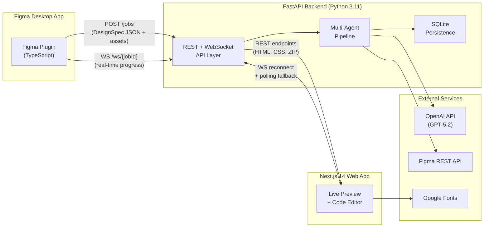
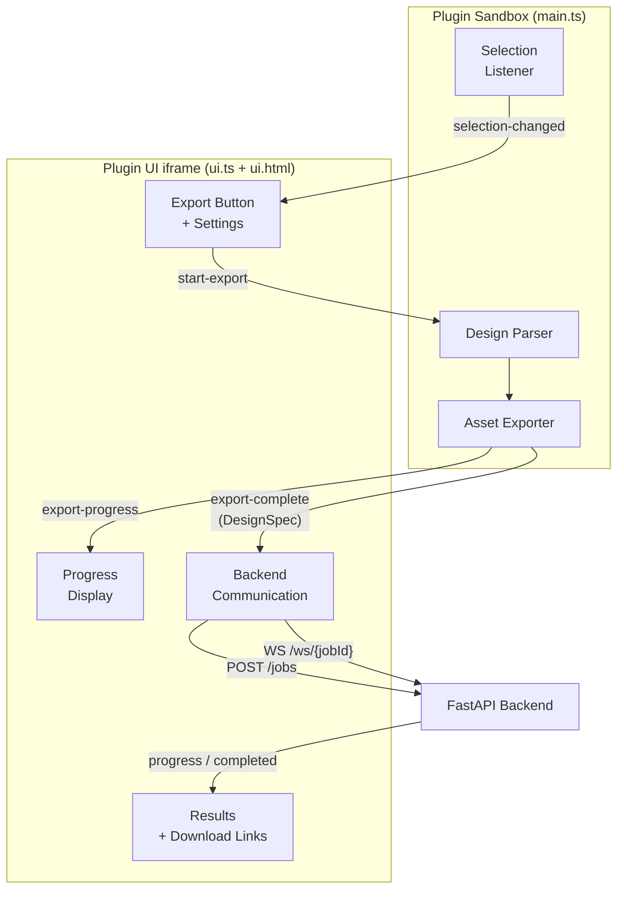
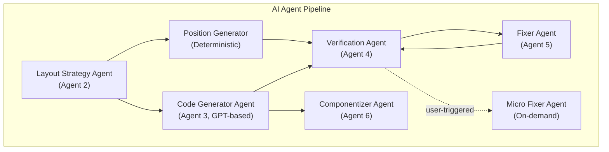
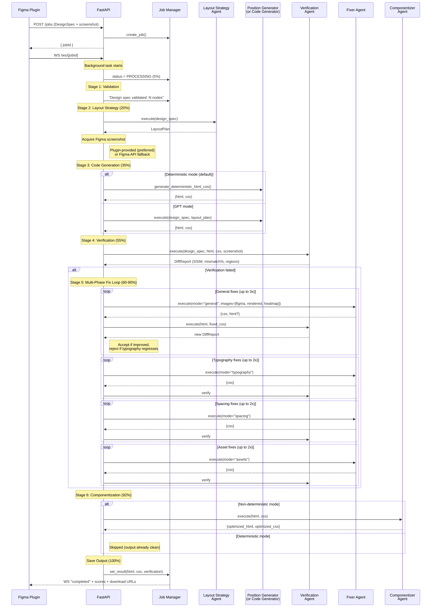
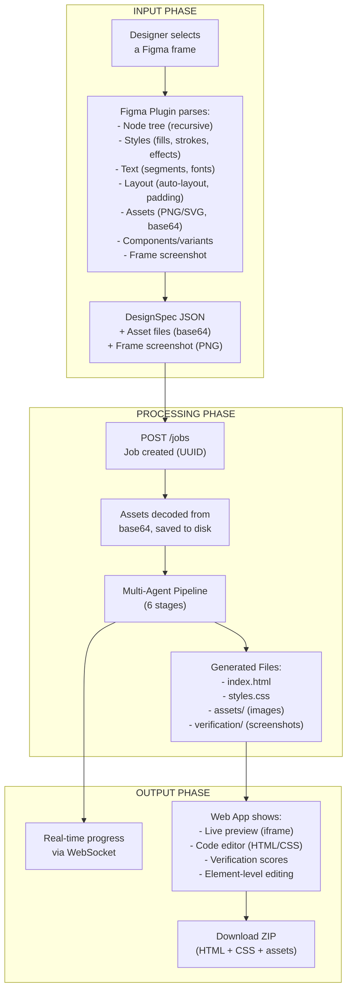
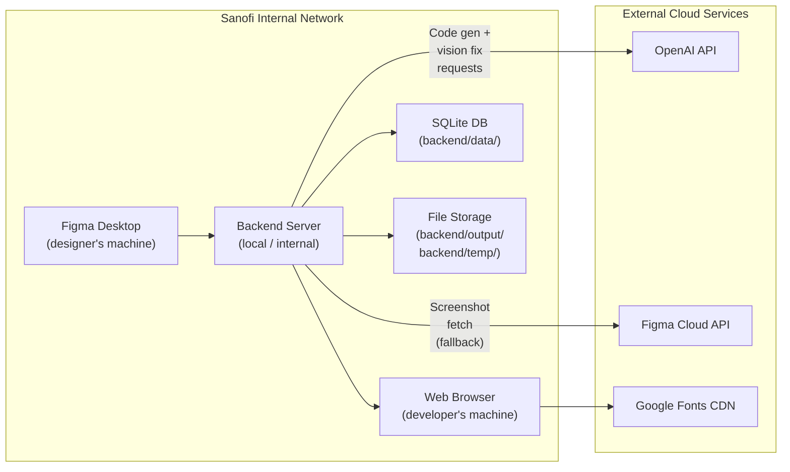

# Figma-to-HTML/CSS Multi-Agent Conversion System -- Architecture Document

## Table of Contents

1. [System Overview](#1-system-overview)
2. [Component Deep-Dive](#2-component-deep-dive)
3. [Multi-Agent Pipeline](#3-multi-agent-pipeline-the-core-of-the-system)
4. [Input / Output Flow](#4-input--output-flow)
5. [Security and Data Safety (Sanofi Context)](#5-security-and-data-safety-sanofi-context)
6. [Configuration Reference](#6-configuration-reference)
7. [API Reference](#7-api-reference)

---

## 1. System Overview

The system converts Figma designs into pixel-perfect, production-ready HTML/CSS through a three-component architecture connected by REST, WebSocket, and Figma Plugin messaging APIs.

### 1.1 High-Level Architecture



### 1.2 Tech Stack Summary

| Layer | Technology | Purpose |
|-------|-----------|---------|
| **Figma Plugin** | TypeScript, Figma Plugin API, esbuild | Extracts design specs from Figma frames |
| **Backend** | Python 3.11, FastAPI, Pydantic, aiosqlite | AI pipeline orchestration, API serving |
| **AI/LLM** | OpenAI GPT-5.2 (configurable) | Code generation, visual CSS fixing |
| **Browser Engine** | Playwright (headless Chromium) | Renders HTML to screenshots for verification |
| **Image Analysis** | scikit-image, Pillow, NumPy | SSIM comparison, pixel diff, heatmap generation |
| **Web App** | Next.js 14, React 18, Zustand, Tailwind CSS | Live preview editor with element-level editing |
| **Database** | SQLite (async via aiosqlite) | Job persistence across restarts |
| **HTTP Client** | httpx (async) | Figma API communication |

### 1.3 Project Structure

```
figma-to-html/
├── backend/                    # FastAPI backend
│   ├── agents/                 # AI agent modules (7 agents)
│   ├── pipeline/               # Job orchestration + persistence
│   ├── routers/                # REST + WebSocket endpoints
│   ├── schemas/                # Pydantic data models
│   ├── services/               # External service wrappers
│   ├── prompts/                # GPT prompt templates
│   ├── templates/              # HTML/CSS base templates
│   ├── config.py               # Environment-based configuration
│   ├── db.py                   # SQLite async database layer
│   └── main.py                 # FastAPI entry point
│
├── figma-plugin/               # Figma plugin (TypeScript)
│   ├── src/
│   │   ├── main.ts             # Plugin sandbox entry point
│   │   ├── ui.ts               # Plugin UI + backend communication
│   │   ├── ui.html             # Plugin UI markup
│   │   ├── parser/             # Design extraction modules (6 extractors)
│   │   ├── types/              # TypeScript type definitions
│   │   └── utils/              # Color, unit, and Figma helper utilities
│   └── manifest.json           # Figma plugin manifest
│
├── web-app/                    # Next.js 14 frontend
│   ├── app/                    # App Router pages
│   ├── components/             # React components (11 components)
│   ├── lib/                    # API, WebSocket, DOM, code mutation utilities
│   ├── store/                  # Zustand state management
│   ├── hooks/                  # Custom React hooks
│   └── types/                  # TypeScript type definitions
│
└── shared/                     # Shared schemas
    └── design-spec-schema.json # JSON Schema for DesignSpec
```

---

## 2. Component Deep-Dive

### 2.1 Figma Plugin (`figma-plugin/`)

The Figma plugin runs inside the Figma Desktop application and serves as the entry point for the entire system. It extracts a complete design specification from a selected Figma frame.

#### Architecture

The plugin operates in two isolated contexts connected by `postMessage`:



**Sandbox (`main.ts`)** -- Runs in Figma's plugin sandbox with access to the Figma Plugin API but no DOM access. Responsibilities:
- Listens for selection changes and notifies the UI
- Validates that the selected node is exportable (FRAME, COMPONENT, INSTANCE, SECTION, or GROUP)
- Orchestrates the `parseFrame()` pipeline when the user triggers export
- Supports export cancellation via a `cancelRequested` flag

**UI (`ui.ts` + `ui.html`)** -- Runs in an iframe with DOM access but no Figma API access. Responsibilities:
- Renders the export button, settings panel, progress bars, and results
- Sends the extracted DesignSpec to the backend via HTTP POST
- Connects to the backend via WebSocket for real-time pipeline progress
- Falls back to HTTP polling (2-second interval, 10-minute max) if WebSocket fails
- Displays verification scores and download links upon completion

#### Parser Modules

The parser is the most critical part of the plugin. It walks the Figma node tree and produces a `DesignSpec` JSON object.

| Module | File | What It Extracts |
|--------|------|-----------------|
| **Orchestrator** | `parser/index.ts` | Coordinates all extractors, handles asset export, captures frame screenshot, assembles final DesignSpec |
| **Node Extractor** | `parser/nodeExtractor.ts` | Recursive traversal of the Figma node tree; extracts bounds, visibility, type, name, and parent-child relationships |
| **Style Extractor** | `parser/styleExtractor.ts` | Fills (solid, gradient, image), strokes, effects (shadows, blurs), border radius, opacity |
| **Text Extractor** | `parser/textExtractor.ts` | Text content, mixed-style segments (font family, size, weight, style, line height, letter spacing, fills) |
| **Layout Extractor** | `parser/layoutExtractor.ts` | Auto-layout mode, direction, padding, item spacing, alignment, constraints |
| **Asset Extractor** | `parser/assetExtractor.ts` | Exports images (PNG/SVG) and background images as base64; handles complex vector groups |
| **Component Extractor** | `parser/componentExtractor.ts` | Component and variant metadata for Figma components/instances |

#### DesignSpec Output Schema

The plugin produces a `DesignSpec` JSON object conforming to `shared/design-spec-schema.json`:

```json
{
  "frameId": "1:23",
  "frameName": "Homepage",
  "width": 1440,
  "height": 900,
  "backgroundColor": { "r": 1, "g": 1, "b": 1, "a": 1 },
  "nodes": [ /* recursive DesignNode tree */ ],
  "assets": [ /* AssetReference[] with filename + base64 data */ ],
  "metadata": {
    "figmaFileKey": "abc123",
    "exportedAt": "2026-03-05T10:00:00Z",
    "pluginVersion": "1.0.0"
  }
}
```

Key types within the spec:
- **DesignNode**: `id`, `name`, `type`, `bounds`, `style`, `layout`, `text`, `children`, `visible`
- **Style**: `fills[]`, `strokes[]`, `effects[]`, `opacity`, `corner_radius`, `overflow`, `rotation`
- **Layout**: `mode` (NONE/HORIZONTAL/VERTICAL), `padding`, `item_spacing`, `primary_axis_align`, `counter_axis_align`
- **TextSegment**: `font_family`, `font_size`, `font_weight`, `font_style`, `line_height`, `letter_spacing`, `fill`

#### Plugin Settings

Users can configure:
- **Backend URL** (default: `http://localhost:8000`)
- **Include invisible nodes** (default: false)
- **Export assets** (default: true)
- **Asset format** (PNG or SVG)
- **Asset scale** (1x, 2x, 3x, 4x)

Settings are persisted in the browser's `localStorage`.

---

### 2.2 FastAPI Backend (`backend/`)

The backend is the processing engine. It receives design specs, orchestrates the multi-agent AI pipeline, and serves the generated output.

#### Entry Point (`main.py`)

- Configures structured logging with optional rotating file handler
- Initializes output and temp directories on startup
- Initializes the job manager (loads persisted jobs from SQLite)
- Cleans up the Playwright browser instance on shutdown
- Mounts CORS middleware and API routers

#### Configuration (`config.py`)

Uses `pydantic-settings` to load configuration from environment variables and `.env` files:

```python
class Settings(BaseSettings):
    # API keys (required)
    OPENAI_API_KEY: str
    FIGMA_ACCESS_TOKEN: str

    # Server
    BACKEND_HOST: str = "0.0.0.0"
    BACKEND_PORT: int = 8000

    # Pipeline tuning
    MAX_FIX_ITERATIONS: int = 5
    MAX_GENERAL_FIX_ITERATIONS: int = 3
    MAX_SPECIALIZED_FIX_ITERATIONS: int = 2
    PIXEL_MISMATCH_THRESHOLD: float = 15.0
    SSIM_THRESHOLD: float = 0.70

    # OpenAI
    OPENAI_MODEL: str = "gpt-5.2"
    OPENAI_MAX_TOKENS: int = 16384
    OPENAI_TEMPERATURE: float = 0.1

    # Generation mode
    USE_DETERMINISTIC_GENERATION: bool = True
```

#### Database Layer (`db.py`)

- Async SQLite via `aiosqlite`
- Stores job metadata, status, HTML/CSS content, and verification results
- Parameterized queries throughout (no string interpolation)
- Database file: `backend/data/jobs.db` (excluded from version control)

#### Services

| Service | File | Responsibility |
|---------|------|---------------|
| **OpenAI Service** | `services/openai_service.py` | GPT-4/5.2 API calls with retry logic (rate limit, connection error, 5xx), vision support (base64 images), token estimation |
| **Browser Service** | `services/browser_service.py` | Headless Chromium via Playwright; renders HTML+CSS to PNG screenshots; font loading and 1s render settle time |
| **Diff Service** | `services/diff_service.py` | SSIM computation, pixel mismatch analysis, grid-based region detection, mismatch classification (layout/color/typography/spacing), heatmap generation |
| **Figma API** | `services/figma_api.py` | Fetches frame screenshots and file node data from `https://api.figma.com` via `X-Figma-Token` header |

#### Schemas

| Schema | File | Models |
|--------|------|--------|
| **Design Spec** | `schemas/design_spec.py` | `DesignSpec`, `DesignNode`, `Style`, `Fill`, `Stroke`, `Effect`, `TextSegment`, `Bounds`, `Layout`, `AssetReference` |
| **Job** | `schemas/job.py` | `JobStatus` (queued/processing/verifying/completed/failed), `JobResult`, `JobResponse`, `MicroFixRequest`, WebSocket message types |
| **Diff Report** | `schemas/diff_report.py` | `DiffReport`, `DiffRegion`, `Severity` (high/medium/low) |
| **Layout Plan** | `schemas/layout_plan.py` | `LayoutStrategy` (flex/grid/absolute/block), `LayoutDecision`, `LayoutPlan` |

---

### 2.3 Next.js Web App (`web-app/`)

A live preview editor that displays generated HTML/CSS and allows interactive editing.

#### Pages

| Route | File | Purpose |
|-------|------|---------|
| `/` | `app/page.tsx` | Job list -- shows all conversion jobs with status, refresh, and delete |
| `/job/[jobId]` | `app/job/[jobId]/page.tsx` | Job editor -- pipeline progress, preview iframe, code panel, element editing |

#### Key Components

| Component | Purpose |
|-----------|---------|
| `PreviewFrame` | Renders generated HTML in a sandboxed iframe with `srcdoc`; handles element click selection; injects a script for DOM introspection and node-to-CSS mapping |
| `CodePanel` | Tabbed HTML/CSS code viewer with syntax highlighting (Prism.js), copy-to-clipboard, and per-file download |
| `ElementEditor` | Floating panel with tabs for Text editing, Spacing, Typography, and Link editing; hosts the AI Fix button |
| `AIFixModal` | Modal for AI micro-fixing: select a problem area, describe the issue (or use preset prompts), and submit to the backend's micro-fix endpoint |
| `SpacingPanel` | Visual margin/padding editor with numeric inputs and drag-to-reposition mode |
| `TextSpacingPanel` | Font size, line height, and letter spacing controls with Figma value comparison |
| `DragOverlay` | Visual overlay for drag-to-reposition interactions |
| `Toolbar` | Top bar with job info, device switcher (Desktop/Tablet/Mobile/Custom), undo, save, and download |
| `DeviceSwitcher` | Viewport preset selector for responsive preview |
| `LinkEditor` | Add, edit, and remove hyperlinks with URL validation (blocks `javascript:` protocol) |
| `ErrorBoundary` | React error boundary for graceful failure handling |

#### State Management

Uses **Zustand** (`store/useEditorStore.ts`) for centralized state:
- Job data, HTML/CSS content, loading/saving status
- Selected element and its computed styles
- Edit operation history (undo stack)
- Position mode (drag-to-reposition toggle)

#### Utility Libraries

| Library | File | Purpose |
|---------|------|---------|
| `api.ts` | `lib/api.ts` | HTTP client for all backend REST calls |
| `websocket.ts` | `lib/websocket.ts` | WebSocket client with auto-reconnect and ping handling |
| `domMapper.ts` | `lib/domMapper.ts` | Builds `srcdoc` for the preview iframe; rewrites asset URLs; injects DOM introspection script |
| `codeMutator.ts` | `lib/codeMutator.ts` | HTML/CSS mutation utilities: text updates, spacing changes, link wrapping, position deltas, typography changes |
| `positionCalculator.ts` | `lib/positionCalculator.ts` | Converts drag deltas to CSS patches based on element position context (absolute, flex, flow) |

---

## 3. Multi-Agent Pipeline (the Core of the System)

The backend uses a multi-agent architecture where each agent handles a specific stage of the conversion process. All agents extend `BaseAgent` which provides progress reporting via WebSocket callbacks.

### 3.1 Agent Inventory



#### Agent 1: Layout Strategy Agent

| Attribute | Value |
|-----------|-------|
| **File** | `backend/agents/layout_strategy.py` |
| **Role** | Analyzes the design tree and selects the optimal CSS layout strategy (flex, grid, absolute, or block) for each container node |
| **Input** | `DesignSpec` |
| **Output** | `LayoutPlan` (mapping of `node_id` to `LayoutDecision`) |
| **Approach** | Rules engine first (auto-layout = flex, overlapping children = absolute, grid pattern = grid, single child = block); falls back to GPT for ambiguous cases |
| **Prompt** | `prompts/layout_strategy.txt` |

#### Agent 2a: Position Generator (Deterministic)

| Attribute | Value |
|-----------|-------|
| **File** | `backend/agents/position_generator.py` |
| **Role** | Generates pixel-accurate HTML/CSS directly from the design tree without any LLM call |
| **Input** | `DesignSpec.root`, asset map, `LayoutPlan` |
| **Output** | `(html_content, css_content)` tuple |
| **Used When** | `USE_DETERMINISTIC_GENERATION=True` (default) |
| **Approach** | Walks the design tree recursively; emits CSS for fills, strokes, effects, typography, border radius, flex/grid layout, and absolute positioning; maps assets to `` tags |

This is the preferred generation mode. It is faster, cheaper (no LLM cost), and produces more predictable output. HTML fixes are enabled in the fixer to correct structural issues.

#### Agent 2b: Code Generator Agent (GPT-based)

| Attribute | Value |
|-----------|-------|
| **File** | `backend/agents/code_generator.py` |
| **Role** | Generates HTML/CSS via GPT-4/5.2 from the design spec and layout plan |
| **Input** | `DesignSpec`, `LayoutPlan`, optional Figma screenshot (for vision context) |
| **Output** | `{"html": str, "css": str}` |
| **Used When** | `USE_DETERMINISTIC_GENERATION=False` |
| **Modes** | Single-call for small designs; chunked generation for large designs (>80 nodes) with parallel section generation and merge |
| **Prompt** | `prompts/code_generation.txt` |
| **Features** | Font mapping to Google/system fonts, completeness checking (coverage ratio, abbreviation detection) |

#### Agent 3: Verification Agent

| Attribute | Value |
|-----------|-------|
| **File** | `backend/agents/verification.py` |
| **Role** | Compares the Figma design screenshot against the rendered HTML output to measure visual fidelity |
| **Input** | `DesignSpec`, `html_content`, `css_content`, optional `figma_screenshot` |
| **Output** | `DiffReport` with pass/fail, SSIM score, pixel mismatch percentage, and classified regions |

**How it works:**
1. **Get Figma screenshot** -- Uses the plugin-provided screenshot (preferred) or fetches via Figma API; pre-crops to expected frame dimensions if oversized
2. **Render HTML to screenshot** -- Writes HTML to a temp file, loads it in headless Chromium via `file://` URL (so relative asset paths resolve), waits for fonts, and captures a viewport-sized screenshot at 2x scale
3. **Compare** -- Calls the diff service which computes SSIM (on downscaled images to 2000px max), pixel mismatch percentage (per-channel threshold of 80 to tolerate font anti-aliasing), and classifies mismatch regions on an 8x8 grid

**Pass criteria**: `pixel_mismatch <= 15.0%` AND `SSIM >= 0.70`

#### Agent 4: Fixer Agent

| Attribute | Value |
|-----------|-------|
| **File** | `backend/agents/fixer.py` |
| **Role** | Iteratively corrects CSS (and optionally HTML) by visually comparing Figma vs rendered screenshots using GPT-4 Vision |
| **Input** | `html_content`, `css_content`, `DiffReport`, Figma screenshot, rendered screenshot, design context, mode |
| **Output** | `{"css": str, "html"?: str}` |

**Fix modes and phases** -- The fixer runs in multiple specialized phases:

| Phase | Mode | Max Iterations | Prompt File | Focus |
|-------|------|---------------|-------------|-------|
| 1 | `general` | 3 | `prompts/fixer.txt` | Overall layout, backgrounds, borders, shadows, positions |
| 2 | `typography` | 2 | `prompts/fixer_typography.txt` | Font size, weight, style, text alignment, overflow, clip-path |
| 3 | `spacing` | 2 | `prompts/fixer_spacing.txt` | Left, top, width, height, padding, margin, gap |
| 4 | `assets` | 2 | `prompts/fixer_assets.txt` | Image width, height, object-fit, object-position, overflow |

**Key mechanisms:**
- **Vision-based**: Sends 3 images to GPT-4 Vision -- (1) Figma screenshot, (2) rendered screenshot, (3) diff heatmap -- so the LLM can visually compare and fix
- **Property-level CSS merge**: Does not replace entire rules; merges individual changed properties into existing rules, preserving critical layout properties
- **Guarded properties**: Each mode has a set of CSS properties that are protected from changes (e.g., general mode guards `color`, `font-family`, `font-size` to prevent typography regressions)
- **Root background protection**: The fixer cannot change the root container's background-color
- **Typography regression guard**: If a fix improves overall score but drops the typography score by >2 points, it is rejected
- **Consecutive failure limit**: If 2 consecutive fix attempts fail to improve, the phase moves on
- **Best-state tracking**: Tracks the best overall state and best typography state separately; can switch to best-typography state before entering the typography phase
- **Letter spacing sanitization**: Clamps `letter-spacing` values to >= -1px to prevent character overlap
- **Image downscaling**: Screenshots are downscaled to max 2048px before sending to GPT-4 Vision to stay within OpenAI's request-size limits

#### Agent 5: Componentizer Agent

| Attribute | Value |
|-----------|-------|
| **File** | `backend/agents/componentizer.py` |
| **Role** | Extracts repeated CSS patterns into shared classes to reduce redundancy |
| **Input** | `html_content`, `css_content` |
| **Output** | `{"html": str, "css": str}` |
| **Used When** | Non-deterministic generation mode only (deterministic output is already clean) |
| **Phases** | (1) Find exact duplicate rule bodies, (2) Find common property subsets, (3) Create shared utility classes |

#### Agent 6: Micro Fixer Agent (On-Demand)

| Attribute | Value |
|-----------|-------|
| **File** | `backend/agents/micro_fixer.py` |
| **Role** | Applies a targeted fix to a single element, triggered by user action in the web app |
| **Input** | `node_id`, `user_prompt`, `html_content`, `css_content` |
| **Output** | Minimal CSS/HTML patch for the targeted node |
| **Prompt** | `prompts/micro_fixer.txt` |
| **Trigger** | `POST /jobs/{id}/micro-fix` from the web app's AI Fix modal |

### 3.2 Pipeline Orchestration

The full pipeline is orchestrated by `pipeline/orchestrator.py` via the `run_pipeline()` async function:



#### Pipeline Stages in Detail

**Stage 1 -- Validation (5%)**
- Verifies the design spec has a root node
- Counts total nodes in the tree
- Reports frame dimensions

**Stage 2 -- Layout Strategy (20%)**
- Runs the Layout Strategy Agent to decide CSS layout per container
- Produces a `LayoutPlan` with decisions for each container node

**Stage 3 -- Code Generation (35%)**
- **Deterministic mode** (default): Calls `generate_deterministic_html_css()` -- walks the tree, emits pixel-accurate CSS, maps assets to `` tags
- **GPT mode**: Calls the Code Generator Agent with the design spec, layout plan, and optional Figma screenshot for vision context

**Screenshot Acquisition** (between stages 2 and 3)
- Priority: (1) Plugin-provided screenshot, (2) Figma API (`get_frame_screenshot` at 2x scale), (3) Skip vision
- The screenshot is reused for both code generation context and verification

**Stage 4 -- Verification (55%)**
- Renders the generated HTML in headless Chromium at the frame's exact dimensions
- Compares against the Figma screenshot using SSIM and pixel mismatch analysis
- Produces a `DiffReport` with pass/fail, scores, and classified regions

**Stage 5 -- Fix Loop (60-90%)**
- Only runs if verification fails
- Multi-phase: general (3x) -> typography (2x) -> spacing (2x) -> assets (2x)
- Each iteration: fix -> verify -> accept/reject
- Tracks best state globally and per-typography; syncs between phases
- Early exit on pass or 2 consecutive non-improvements per phase
- Enables HTML fixes when pixel mismatch > 20% or code coverage < 80%

**Stage 6 -- Componentization (92%)**
- Only runs in non-deterministic mode
- Deduplicates CSS into shared classes

**Save Output (100%)**
- Writes `index.html` with Google Fonts links and CSS reset
- Writes `styles.css` with CSS reset prepended
- Copies assets from temp to output directory
- Copies verification screenshots (Figma, rendered, diff heatmap)
- Persists job result to SQLite

---

## 4. Input / Output Flow

### 4.1 Complete Data Flow



### 4.2 Input Path (Detail)

1. **User selects a frame** in Figma Desktop
2. **Plugin sandbox** detects the selection change, validates it is exportable, and sends frame metadata (name, dimensions, node count) to the UI
3. **User clicks Export** -- the UI sends `start-export` to the sandbox
4. **Parser pipeline** runs inside the sandbox:
   - `nodeExtractor` recursively walks the Figma node tree
   - `styleExtractor` extracts fills, strokes, effects, borders
   - `textExtractor` extracts text content with mixed-style segments
   - `layoutExtractor` extracts auto-layout, padding, constraints
   - `assetExtractor` exports images/vectors as base64 PNG or SVG
   - `componentExtractor` captures component/variant metadata
   - The frame is rendered to a PNG screenshot via `exportAsync`
5. **DesignSpec assembled** and sent to the UI via `postMessage`
6. **UI sends to backend** via `POST /jobs` with the full DesignSpec JSON (including base64 asset data and screenshot)
7. **Backend creates job**, decodes base64 assets to disk, and starts the pipeline as a background task
8. **UI connects via WebSocket** (`WS /ws/{jobId}`) to receive real-time progress updates

### 4.3 Output Path (Detail)

1. **Pipeline generates** HTML + CSS through the multi-agent process
2. **WebSocket messages** stream to the plugin UI and web app:
   - `progress` messages with step name, percentage (0-100), and details
   - `completed` message with verification scores and download URLs
   - `error` message if the pipeline fails
3. **Plugin UI** displays verification scores (overall, layout, color, typography, spacing) and download links (ZIP, HTML, CSS, live preview)
4. **Web App** at `http://localhost:3000` shows:
   - Job list on the home page
   - Per-job editor with live preview iframe, code panel, element selection
   - Element-level editing: text content, spacing (margin/padding), typography (font size, line height, letter spacing), hyperlinks
   - AI micro-fix for targeted fixes
   - Undo, save (persists to backend), and download (ZIP export)
5. **ZIP download** bundles `index.html`, `styles.css`, and the `assets/` folder

### 4.4 WebSocket Message Types

| Type | Direction | Payload |
|------|-----------|---------|
| `progress` | Server -> Client | `{ step, progress (0-100), detail }` |
| `completed` | Server -> Client | `{ result: { html_url, css_url, zip_url, preview_url, verification } }` |
| `error` | Server -> Client | `{ error: string }` |
| `log` | Server -> Client | `{ level, message }` |
| `ping` | Server -> Client | Keepalive (no payload) |

---

## 5. Security and Data Safety (Sanofi Context)

### 5.1 Current Security Posture

#### Secrets Management

| Secret | Storage | Exposure |
|--------|---------|----------|
| `OPENAI_API_KEY` | `.env` file (server-side only) | Never sent to client; used only in `openai_service.py` via server-side `AsyncOpenAI` client |
| `FIGMA_ACCESS_TOKEN` | `.env` file (server-side only) | Never sent to client; used only in `figma_api.py` via `X-Figma-Token` header to `api.figma.com` |
| `NEXT_PUBLIC_API_URL` | `.env.local` (web app) | Contains only the backend URL (no secrets) |

All `.env` files are excluded from version control via `.gitignore`:

```
.env
.env.local
.env*.local
```

A `.env.example` template with placeholder values is committed for developer onboarding.

#### API Key Isolation

API keys are loaded via `pydantic-settings` (`BaseSettings`) which reads from environment variables or `.env` files. The keys live exclusively on the backend server:

- **OpenAI key** -- Used only in `services/openai_service.py`. The key is passed to the `AsyncOpenAI` client constructor. It never appears in API responses, WebSocket messages, or log output.
- **Figma token** -- Used only in `services/figma_api.py`. Sent as `X-Figma-Token` header exclusively to `https://api.figma.com`. It never appears in API responses or client-facing output.

The Figma plugin does **not** send or receive any API keys. It communicates only the DesignSpec payload and receives job status/results.

#### Data Flow to External Services

| External Service | Data Sent | Purpose |
|-----------------|-----------|---------|
| **OpenAI API** (`api.openai.com`) | Design spec metadata, CSS code, HTML snippets, base64-encoded screenshots (Figma + rendered) | Code generation and visual CSS fixing |
| **Figma API** (`api.figma.com`) | File key, node IDs | Fetching frame screenshots (fallback when plugin screenshot unavailable) |
| **Google Fonts** (`fonts.googleapis.com`) | Font family names | Loading web fonts for rendering and preview |

**No design data is stored by the system outside the local server.** All generated files (HTML, CSS, assets, screenshots) are stored in local directories (`backend/output/`, `backend/temp/`), both excluded from version control.

#### Frontend Protections

- **XSS prevention**: The `codeMutator.ts` utility validates URLs before wrapping text in links using `isUrlSafe()`, which blocks `javascript:` protocol URLs and only allows `http:`, `https:`, `mailto:`, and `tel:`
- **HTML escaping**: The plugin UI uses `escapeHtml()` (DOM-based text content injection) for all user-visible strings
- **Iframe sandboxing**: The web app renders generated HTML inside an iframe using `srcdoc`, which provides natural isolation from the host page

### 5.2 Data Locality and Processing



- **All design data processing** happens on the local/internal backend server
- **SQLite database** and **generated files** remain on the backend server's filesystem
- **No persistent storage** of design data occurs on external services
- The **only data leaving the network** are:
  1. Code snippets and screenshots sent to OpenAI for generation/fixing (covered by OpenAI's data use policy -- API data is not used for training)
  2. File key and node ID sent to Figma API for screenshot retrieval (only when plugin screenshot is unavailable)
  3. Font family names sent to Google Fonts CDN

### 5.3 Current Security Gaps

| Gap | Risk Level | Description |
|-----|-----------|-------------|
| **No authentication** | High | All API endpoints are unauthenticated. Any network-reachable client can create jobs, read results, and delete data. |
| **Permissive CORS** | Medium | `allow_origins=["*"]` with `allow_credentials=True` permits any origin to make authenticated requests. |
| **No rate limiting** | Medium | No application-level rate limiting on `POST /jobs` or `POST /{id}/micro-fix`. An attacker could consume OpenAI API credits. |
| **Path traversal risk** | Medium | The asset-serving endpoint (`GET /{job_id}/assets/{filename:path}`) does not validate that the resolved path stays within the expected asset directory. A crafted `filename` with `../` could read arbitrary server files. |
| **No TLS** | Medium | The backend serves over plain HTTP. In-transit data (including design specs) is not encrypted. |
| **No encryption at rest** | Low | SQLite database and generated files are stored in plain text on disk. |
| **Health endpoint exposes config** | Low | The `/health` endpoint reveals whether API keys are configured (boolean, not the keys themselves). |

### 5.4 Recommendations for Sanofi Enterprise Deployment

#### Priority 1: Authentication and Authorization

- **Implement SSO/SAML integration** with Sanofi's identity provider (e.g., Azure AD/Entra ID)
- **Add JWT-based authentication** to all API endpoints using FastAPI's dependency injection
- **Role-based access control**: Restrict job creation, viewing, and deletion based on user roles
- **API key rotation policy**: Rotate OpenAI and Figma tokens on a regular schedule

#### Priority 2: Network Security

- **Restrict CORS origins** to known domains (Figma plugin origin, internal web app URL, production domains)
- **Deploy behind TLS termination** (e.g., NGINX reverse proxy with Let's Encrypt or corporate CA certificates)
- **Network isolation**: Run the backend in a VPC/private subnet with no direct internet exposure; use a NAT gateway or proxy for outbound OpenAI/Figma API calls
- **Web Application Firewall (WAF)**: Deploy a WAF in front of the backend to filter malicious requests

#### Priority 3: Application Hardening

- **Fix path traversal**: Validate that resolved asset paths are within the expected directory using `Path.resolve()` and checking that the result starts with the expected base path
- **Add rate limiting**: Use `slowapi` or similar to limit `POST /jobs` (e.g., 10/minute/user) and `POST /micro-fix` (e.g., 20/minute/user)
- **Request size limits**: Enforce maximum request body size to prevent abuse via oversized DesignSpec payloads
- **Input validation**: Add strict validation on the DesignSpec schema before processing

#### Priority 4: Data Protection

- **Encryption at rest**: Enable SQLite encryption (e.g., SQLCipher) or migrate to an encrypted database (PostgreSQL with disk encryption)
- **Data retention policy**: Implement automatic cleanup of old jobs and temporary files (e.g., 30-day TTL)
- **Audit logging**: Log all API access with user identity, action, timestamp, and resource for compliance

#### Priority 5: Operational Security

- **Secrets management**: Migrate from `.env` files to a secrets manager (AWS Secrets Manager, Azure Key Vault, HashiCorp Vault)
- **Container deployment**: Package the backend as a Docker container with minimal base image, non-root user, and read-only filesystem
- **Dependency scanning**: Add automated vulnerability scanning for Python (pip-audit) and Node.js (npm audit) dependencies
- **Security headers**: Add `Strict-Transport-Security`, `X-Content-Type-Options`, `X-Frame-Options`, and `Content-Security-Policy` headers

#### OpenAI Data Privacy Note

For Sanofi's compliance requirements, note that OpenAI's API data use policy (as of March 2026) states that data sent via the API is **not used for model training**. However, data may be retained for up to 30 days for abuse monitoring. For maximum data protection:
- Consider using **Azure OpenAI Service** which offers enterprise data residency and does not retain request data
- Review OpenAI's current data processing agreement (DPA) with Sanofi's legal/compliance team
- Evaluate using a **private LLM deployment** if design data sensitivity requires zero external data transmission

---

## 6. Configuration Reference

### 6.1 Backend Environment Variables (`backend/.env`)

| Variable | Required | Default | Description |
|----------|----------|---------|-------------|
| `OPENAI_API_KEY` | Yes | -- | OpenAI API key for GPT calls |
| `FIGMA_ACCESS_TOKEN` | Yes | -- | Figma Personal Access Token for screenshot fetching |
| `OPENAI_MODEL` | No | `gpt-5.2` | LLM model identifier (`gpt-4o`, `gpt-5.2`, `o1`, `o3`, etc.) |
| `OPENAI_MAX_TOKENS` | No | `16384` | Maximum response tokens per GPT call |
| `OPENAI_TEMPERATURE` | No | `0.1` | Sampling temperature (lower = more deterministic) |
| `MAX_FIX_ITERATIONS` | No | `5` | Total maximum fix iterations (legacy, overridden by phase-specific settings) |
| `MAX_GENERAL_FIX_ITERATIONS` | No | `3` | Maximum general-phase fix iterations |
| `MAX_SPECIALIZED_FIX_ITERATIONS` | No | `2` | Maximum iterations per specialized phase (typography, spacing, assets) |
| `SSIM_THRESHOLD` | No | `0.70` | SSIM score threshold for verification pass (0.0-1.0) |
| `PIXEL_MISMATCH_THRESHOLD` | No | `15.0` | Pixel mismatch percentage threshold for verification pass |
| `USE_DETERMINISTIC_GENERATION` | No | `True` | Use deterministic HTML/CSS generator (no LLM for code generation, faster and cheaper) |
| `CHUNK_NODE_THRESHOLD` | No | `80` | Node count threshold for chunked generation (GPT mode only) |
| `CHUNK_MAX_NODES_PER_SECTION` | No | `40` | Max nodes per chunk section (GPT mode only) |
| `CHUNK_MAX_CONCURRENT` | No | `3` | Max concurrent chunk generation calls (GPT mode only) |
| `BACKEND_HOST` | No | `0.0.0.0` | Server bind address |
| `BACKEND_PORT` | No | `8000` | Server port |
| `LOG_LEVEL` | No | `INFO` | Logging level (DEBUG, INFO, WARNING, ERROR) |
| `LOG_FILE` | No | -- | Path to log file (rotating, 10 MB, 3 backups); console-only if empty |
| `OUTPUT_DIR` | No | `./output` | Directory for generated HTML/CSS/assets |
| `TEMP_DIR` | No | `./temp` | Directory for temporary files (screenshots, verification) |

### 6.2 Web App Environment Variables (`web-app/.env.local`)

| Variable | Required | Default | Description |
|----------|----------|---------|-------------|
| `NEXT_PUBLIC_API_URL` | No | `http://localhost:8000` | Backend API URL |

### 6.3 Pipeline Tuning Guide

| Goal | Adjust |
|------|--------|
| **Higher fidelity** | Increase `MAX_GENERAL_FIX_ITERATIONS` (more fix passes), lower `SSIM_THRESHOLD` / `PIXEL_MISMATCH_THRESHOLD` (stricter pass criteria) |
| **Faster processing** | Decrease `MAX_GENERAL_FIX_ITERATIONS`, increase `PIXEL_MISMATCH_THRESHOLD` (accept more difference) |
| **Lower cost** | Keep `USE_DETERMINISTIC_GENERATION=True` (no LLM for code gen), decrease max iterations |
| **Better typography** | Increase `MAX_SPECIALIZED_FIX_ITERATIONS` for more typography fix passes |
| **Handle large designs** | Adjust `CHUNK_NODE_THRESHOLD` and `CHUNK_MAX_NODES_PER_SECTION` (GPT mode); deterministic mode handles large designs natively |

---

## 7. API Reference

### 7.1 REST Endpoints

All endpoints are served from the backend at `http://{BACKEND_HOST}:{BACKEND_PORT}`.

| Method | Endpoint | Description | Request Body | Response |
|--------|----------|-------------|-------------|----------|
| `GET` | `/health` | Health check | -- | `{ status, version, openai_configured, figma_configured }` |
| `POST` | `/jobs` | Create a new conversion job | `{ designSpec, options? }` (JSON or multipart) | `{ jobId, status }` |
| `GET` | `/jobs` | List all jobs | -- | `[ { id, status, frame_name, created_at, ... } ]` |
| `GET` | `/jobs/{id}` | Get job status and details | -- | `{ id, status, progress, currentStep, result?, error? }` |
| `DELETE` | `/jobs/{id}` | Delete a job and its files | -- | `{ deleted: true }` |
| `GET` | `/jobs/{id}/html` | Get generated HTML content | -- | HTML string (text/html) |
| `GET` | `/jobs/{id}/css` | Get generated CSS content | -- | CSS string (text/css) |
| `GET` | `/jobs/{id}/styles.css` | Alias for CSS endpoint | -- | CSS string (text/css) |
| `GET` | `/jobs/{id}/preview` | Get full preview page (HTML + inline CSS) | -- | Complete HTML document |
| `GET` | `/jobs/{id}/assets/{path}` | Serve asset files (images, fonts) | -- | Binary file with appropriate MIME type |
| `GET` | `/jobs/{id}/diff-image` | Get the diff heatmap image | -- | PNG image |
| `POST` | `/jobs/{id}/update` | Save edited HTML/CSS | `{ html, css }` | `{ updated: true }` |
| `GET` | `/jobs/{id}/download` | Download as ZIP file | -- | ZIP archive (application/zip) |
| `GET` | `/jobs/{id}/design-spec/nodes` | Get design spec for specific node IDs | Query: `ids=nodeId1,nodeId2` | `{ nodes: [...] }` |
| `POST` | `/jobs/{id}/micro-fix` | AI micro-fix for a specific element | `{ nodeId, userPrompt, html, css }` | `{ html, css }` |

### 7.2 WebSocket Endpoint

| Protocol | Endpoint | Description |
|----------|----------|-------------|
| `WS` | `/ws/{job_id}` | Real-time progress updates for a conversion job |

**Connection flow:**
1. Client connects to `ws://{host}:{port}/ws/{job_id}`
2. Server verifies the job exists
3. Server sends `progress` messages as the pipeline advances
4. Server sends `completed` with full result or `error` on failure
5. Server sends periodic `ping` messages for keepalive
6. Connection closes when job reaches a terminal state

---

*Document generated on 2026-03-05. This reflects the current state of the codebase and should be updated as the system evolves.*
